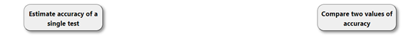
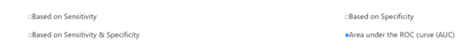
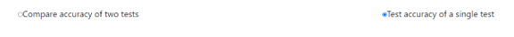

# Sample-Size-Calculator 

This project was based on Angular and developed by "Power-team". This project provides several frequently-used functions for calculating sample size and evaluating the accuracy of diagnostic tests.

An online sample was provided [here](https://power-app2.web.app/).

## Main functions

Currently this APP provides two types of calculations which are "Estimate accuracy of a single test" and " Compare two values of accuracy".

### Estimate accuracy of a single test

Under the "Estimate accuracy of a single test", you can chose different types of input to estimate the sample size that you needed.

### Compare two values of accuracy

Test accuracy of a single test or compare accuracies of two tests. In both scenarios, the hope is to reject the hypothesis of equivalence and thus prove that the accuracies are different. Testing the accuracy of a single test means studying the equivalence of your test to a predetermined level of accuracy. Here is a calculator that helps you in testing your hypothesis with a desired precision, i.e. confidence level, and power.

### Formula and referrences

In this project, the formulas and referrences can be found at the bottom of the page.

## Running this project in your local environment

### step 1: install angular 
    npm install -g @angular/cli
### step 2: go to the directory of the project, e.g.
    cd /sample-size-calculator

### step 3: run the application
    ng serve

## Improvenent

If you are interested in contributing to this project, feel free to folk this projet and commit your code. 
